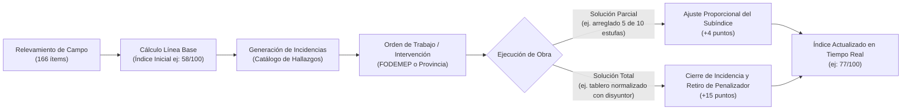
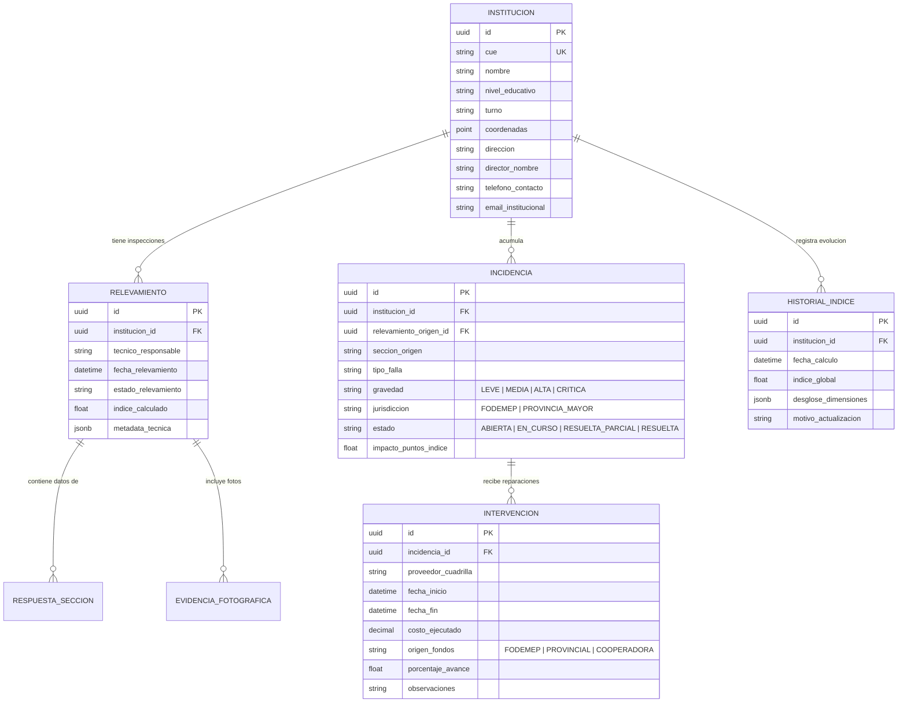

# Sistema Integral de Relevamiento y Monitor de Infraestructura Escolar — FoDeMEEP Río Cuarto

> **Hito Provincial de Modernización**: Plataforma para la recolección técnica in situ, auditoría cuantitativa mediante índice ponderado (0-100) y monitoreo en tiempo real de la infraestructura escolar pública en Río Cuarto, Córdoba.

---

## 1. Visión y Objetivos Estratégicos

El programa FoDeMEEP (Fondo para la Descentralización del Mantenimiento de Edificios Escolares Provinciales) requiere superar el registro estático en papel o formularios genéricos, convirtiéndose en un **sistema inteligente de gestión de activos y mantenimiento predictivo/correctivo**.

### Metas Fundamentales
1. **Recolección en Campo Homogénea (PWA Móvil)**: Guiar al técnico mediante un relevamiento estandarizado de 14 secciones (166 variables), con captura fotográfica georreferenciada y funcionamiento offline.
2. **Índice de Estado de Situación Institucional (IES / 0–100)**: Ponderar matemáticamente la salud edilicia y de servicios de cada escuela.
3. **Trazabilidad Dinámica e Histórica**: Permitir que el índice mejore o cambie automáticamente ante cada intervención (reparación de calefactor, reposición de tanque, recambio de luminarias) sin necesidad de reiniciar una inspección completa.
4. **Monitor de Control Municipal / Provincial**: Tablero ejecutivo con mapa geoespacial de Río Cuarto, semaforización de riesgos críticos y clara demarcación de competencias: **Mantenimiento FoDeMEEP** vs. **Obras Mayores de Provincia**.

---

## 2. Modelo Matemático del Índice de Situación Institucional (0 a 100)

El formulario de relevamiento contempla variables cualitativas (escala Lickert: *Excelente, Bueno, Regular, Malo, Crítico*) y cuantitativas (equipos en funcionamiento vs. fuera de servicio). 

### 2.1. Estructura de Dimensiones y Ponderaciones
El índice global de una institución $I_{\text{global}} \in [0, 100]$ se compone de la suma ponderada de 7 subíndices temáticos:

| Dimensión | Ponderación ($w_i$) | Secciones del Relevamiento Involucradas | Justificación de Impacto |
| :--- | :---: | :--- | :--- |
| **Seguridad de Vida e Instalaciones Críticas** | **25%** | Sec. 4 (Gas) + Sec. 9 (Tableros/Disyuntores) + Sec. 10 (Matafuegos/Evacuación) | Riesgo inminente para alumnos y personal docente. |
| **Agua Potable y Saneamiento** | **20%** | Sec. 5 (Cloacas) + Sec. 7 (Tanques/Bombas) + Sec. 8 (Sanitarios/Canillas) | Garantía de salubridad y continuidad de clases presenciales. |
| **Estructura Edilicia y Cubiertas** | **18%** | Sec. 3 (Techos, Filtraciones, Muros, Pisos, Aberturas) | Integridad física del inmueble y prevención de colapsos. |
| **Climatización y Acondicionamiento** | **15%** | Sec. 6 (Calefactores, Calderas, Ventiladores, AA) | Bienestar térmico invernal/estival para el aprendizaje. |
| **Espacios de Alimentación y Cocina** | **10%** | Sec. 13 (Cocina, Heladeras, Termotanques PAICOR) | Soporte nutricional diario indispensable (PAICOR). |
| **Accesibilidad e Inclusión** | **7%** | Sec. 12 (Rampas, Baños adaptados, Desniveles) | Cumplimiento normativo y equidad educativa. |
| **Entorno Exterior y Patios** | **5%** | Sec. 11 (Arbolado con riesgo, Veredas, Cercos perimetrales) | Seguridad perimetral y recreación al aire libre. |

$$\text{Puntaje Base} = \sum_{i=1}^{7} w_i \times D_i \quad \text{donde } D_i \in [0, 100]$$

---

### 2.2. Penalizadores de Riesgo Crítico ("Kill-Switches")
Un establecimiento no puede figurar con estado "Aceptable" si presenta fallas con peligro letal. Se aplican **multiplicadores de penalización ($P$)** o techos máximos si se detectan:
* **Fuga de gas o cañería fuera de norma NAG-200**: Penalización directa $\times 0.70$ y emisión de **Alerta Roja**.
* **Ausencia de disyuntor diferencial o cables expuestos en aulas**: Penalización $\times 0.75$.
* **Riesgo inminente de desprendimiento de revoque o cielorraso**: Penalización $\times 0.80$.
* **Contaminación de tanque de agua o falta total de suministro**: Penalización $\times 0.80$.

$$I_{\text{final}} = \min(100, \max(0, \text{Puntaje Base} \times \prod P_{\text{riesgos}}))$$

---

### 2.3. Dinámica Histórica y Resolución Parcial de Inconvenientes
Para que el índice no sea estático, cada problema detectado en el relevamiento genera una **Incidencia Identificada**:

* Cada incidencia tiene un **peso restaurativo**: resolver un problema crítico aporta una mejora inmediata en el subíndice correspondiente.
* **Historial de auditoría**: El sistema conserva el índice en cada fecha (línea de tiempo), mostrando la curva de inversión y mejora de cada establecimiento.

---

## 3. Taxonomía Oficial de Incidencias FoDeMEEP Río Cuarto

El sistema adopta de manera estricta la clasificación histórica y operativa de FoDeMEEP Río Cuarto (20 tipos de incidencias), vinculando automáticamente las fallas detectadas en el relevamiento con la cuadrilla/rubro correspondiente:

| Tipo Oficial de Incidencia | Frecuencia Histórica | Sección del Relevamiento Vinculada | Tipo de Cuadrilla / Acción Operativa |
| :--- | :---: | :--- | :--- |
| **PLOMERIA** | 310 | Sec. 8 (Canillas, inodoros, mochilas) | Plomero / recambio de griferías y flotantes |
| **ELECTRICIDAD** | 233 | Sec. 9 (Tableros, térmicas, luminarias, cables) | Electricista matriculado / normalización de tableros |
| **HERRERIA** | 170 | Sec. 3 (Portones, rejas, aberturas), Sec. 12 | Herrero / soldadura, ajuste de cerramientos |
| **GAS** | 132 | Sec. 4 (Pérdidas, cañerías, nichos, llaves) | Gasista matriculado / inspección NAG-200 |
| **DESINFECCIÓN** | 72 | Sec. 7 (Desinfección de tanques, plagas) | Empresa de saneamiento ambiental |
| **VARIOS** | 61 | Todas | Mantenimiento menor general |
| **PINTURA** | 60 | Sec. 3 (Paredes, cielorrasos), Sec. 11 | Cuadrilla de pintura |
| **ALBAÑILERIA** | 44 | Sec. 3 (Revoques, pisos, grietas), Sec. 11 | Albañil / reparaciones de mampostería |
| **REPARACION/MANT. DE ARTEFACTOS** | 35 | Sec. 6 (Calefactores, AA), Sec. 13 (Cocina) | Servicio técnico electromecánico / gas |
| **FILTRACIONES** | 29 | Sec. 3 (Techos de losa/chapa, humedad) | Techista / colocación de membrana o zinguería |
| **MATAFUEGOS** | 28 | Sec. 10 (Carga, obleas, provisión) | Proveedor certificado de extintores |
| **PODA/CORTE DE PASTO** | 25 | Sec. 11 (Espacios verdes, árboles riesgosos) | Cuadrilla de espacios verdes / motosierristas |
| **BOMBA** | 23 | Sec. 7 (Bombas de agua, fallas, potencia) | Bobinador / recambio o service de electrobombas |
| **LIMPIEZA DE TANQUE/CISTERNA** | 18 | Sec. 7 (Limpieza periódica tanques/cisternas) | Cuadrilla especializada con análisis bacteriológico |
| **MOBILIARIO** | 16 | Sec. 2, 8, 13 (Mesadas, bancos, armarios) | Carpintería / reposición de mobiliario escolar |
| **DESAGOTE** | 13 | Sec. 5 (Cámaras sépticas, pozos absorbentes) | Camión atmosférico municipal |
| **LIMPIEZA DE DESAGUES** | 4 | Sec. 5 (Canaletas pluviales, desagües tapados) | Cuadrilla de desobstrucción |
| **OBRA** | 4 | Sec. 3, 5, 7 (Infraestructura mayor) | Derivación formal a Infraestructura Provincial |
| **ADQUISICION ART. CLIMATIZACION** | 3 | Sec. 6 (Faltantes de calefactores o ventiladores)| Compra y provisión de equipamiento nuevo |
| **CAMION CISTERNA** | 2 | Sec. 7 (Emergencia hídrica por falta de agua) | Suministro de emergencia de agua potable |

---

## 4. Modelo de Datos Relacional (PostgreSQL / Prisma / Supabase)

El diseño separa la entidad física (Edificio/Institución), las inspecciones completas de campo, los hallazgos atómicos y las intervenciones correctivas.

---

## 4. Diseño UX / UI de las Dos Herramientas Clave

### 4.1. Herramienta de Campo (App Móvil para Técnicos)
* **Modo Offline-First**: Almacenamiento local (IndexedDB / LocalStorage) para cargar datos sin señal en sótanos, salas de máquinas o patios lejanos; sincronización automática al recuperar cobertura.
* **Ergonomía de Captura Rápida**:
  * Taps táctiles grandes con retroalimentación clara.
  * Botones preseleccionados para la escala unificada (Excelente, Bueno, Regular, Malo, Crítico).
  * Contador numérico dinámico (ej: Total de calefactores, funcionando vs averiados).
* **Cámara Directa Integrada**:
  * Toma de foto con compresión automática en el navegador (WebP < 300KB) para cuidar la memoria y datos móviles.
  * Asociación automática de la foto con su sección y etiquetado técnico.
* **Barra de Progreso y Guardado en Borrador**: Navegación ágil por las 14 secciones sin perder datos.

### 4.2. Monitor General FoDeMEEP (Dashboard de Toma de Decisiones)
* **Mapa Interactivo de Río Cuarto**:
  * Capa GIS con las instituciones educativas.
  * Marcadores coloreados por semáforo de riesgo:
    * 🔴 **Crítico (< 50 pts)**: Intervención prioritaria inmediata.
    * 🟡 **Regular (50 – 69 pts)**: Requiere asignación de cuadrillas FoDeMEEP a corto plazo.
    * 🟢 **Bueno (70 – 89 pts)**: Mantenimiento preventivo.
    * 🔵 **Óptimo (90 – 100 pts)**: Estándar de excelencia provincial.
* **Matriz de Derivación Inteligente**:
  * Filtro con un clic: *¿Qué puede resolver Río Cuarto con fondos FoDeMEEP?* (plomería, llaves de paso, vidrios, térmicas, estufas) vs. *¿Qué requiere expediente ministerial provincial?* (recambio integral de cubierta de losa, ampliación de red de gas).
* **Ficha Técnica Individual y Reporte PDF**:
  * Generación en 1 segundo de informe pericial con fotos antes/después para rendición de cuentas del Tribunal de Cuentas y Ministerio.

---

## 5. Plan de Ejecución Inmediata

1. **Fase 1 (Inmediata)**: Definición detallada del Diccionario de Datos de las 166 preguntas y prototipo funcional del Formulario de Campo (PWA) + Motor de Cálculo del Índice.
2. **Fase 2**: Integración de la Base de Datos y Módulo de Gestión de Incidencias/Intervenciones con cálculo histórico.
3. **Fase 3**: Dashboard Ejecutivo con Mapa de Río Cuarto, analítica de cuadrillas, reportes de auditoría y exportación ejecutiva.
