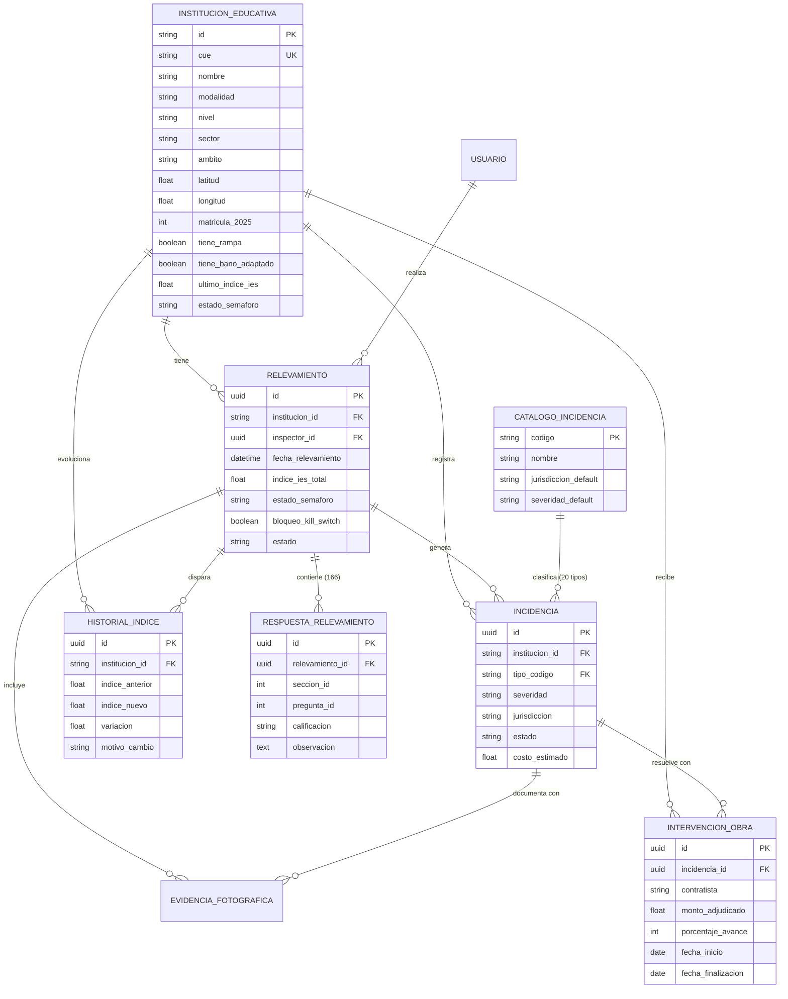

# Sistema FODEMEP Río Cuarto: Modelo Relacional y Padrón Filtrado de Instituciones

Este documento detalla el proceso de depuración, filtrado riguroso del padrón de instituciones educativas de Río Cuarto y la especificación completa del modelo de datos relacional para **PostgreSQL / Supabase** y **Prisma ORM**.

---

## 1. Padrón Depurado de Instituciones Educativas

Se procesó la base de datos oficial provista, aplicando los criterios estrictos solicitados:
- **Modalidad**: `Común`
- **Sector**: `Público`
- **Ámbito**: `Urbano` y `Rural / Periférico`
- **Exclusión**: Instituciones del sector Privado (82), Municipal (29), y filas de métricas/resumen agregadas.

### Resumen del Filtrado

| Métrica | Cantidad |
| :--- | :--- |
| **Total Instituciones Filtradas (Común + Público)** | **84** |
| - Nivel Inicial (Jardines de Infantes) | 32 |
| - Nivel Primario (Escuelas Primarias) | 31 |
| - Nivel Primario + Inicial | 1 |
| - Nivel Secundario (IPEM / IPET / Colegios) | 20 |
| **Ámbito Urbano** | 83 |
| **Ámbito Periférico / Rural** | 1 |
| **Instituciones con Coordenadas GPS exactas** | 82 / 84 (97.6%) |
| **Instituciones con Rampa de Accesibilidad** | 37 (44.0%) |
| **Instituciones con Baño Adaptado** | 28 (33.3%) |
| **Instituciones con Silla de Ruedas** | 6 (7.1%) |

> [!NOTE] Padrón Completo de Instituciones Públicas Provinciales (126)
> En la base original, los niveles **Superior** (como la *Escuela Normal Urquiza*, *Instituto Menéndez Pidal*, *Conservatorio Provincial*, *Líbero Pierini*) y **Formación Profesional** (*CEDER*) fueron clasificados por la administración original bajo la etiqueta "Adultos" o "Artística", y las de educación inclusiva bajo "Especial". 
> Para garantizar total cobertura de las instituciones que dependen del fondo provincial FoDeMEEP, se generaron **dos versiones**:
> 1. `instituciones_comun_publico.json` / `.csv` (84 escuelas - estrictamente Modalidad Común).
> 2. `instituciones_publicas_rio_cuarto_completo.json` / `.csv` (126 escuelas - la totalidad de instituciones públicas provinciales de Río Cuarto).

---

## 2. Diagrama Entidad-Relación (ERD)

---

## 3. Catálogo Oficial de 20 Incidencias FoDeMEEP

Se estructuró el catálogo normalizado con las 20 categorías oficiales y su despacho operativo:

| Código | Denominación Oficial | Jurisdicción por Defecto | Nivel Severidad |
| :--- | :--- | :--- | :--- |
| `PLOMERIA` | Plomería y Grifería | `FODEMEP` (Municipal) | Media |
| `ELECTRICIDAD` | Electricidad e Iluminación | `FODEMEP` (Municipal) | Grave |
| `HERRERIA` | Herrería y Cerramientos | `FODEMEP` (Municipal) | Media |
| `GAS` | Gas y Calefacción (*Kill-Switch*) | `FODEMEP` (Municipal) | Crítica |
| `DESINFECCION` | Desinfección y Control de Plagas | `FODEMEP` (Municipal) | Media |
| `VARIOS` | Mantenimiento General / Cerrajería | `FODEMEP` (Municipal) | Leve |
| `PINTURA` | Pintura Interior y Fachada | `FODEMEP` (Municipal) | Leve |
| `ALBANILERIA` | Albañilería y Solados | `FODEMEP` (Municipal) | Media |
| `REPARACION_ARTEFACTOS` | Reparación de Artefactos | `FODEMEP` (Municipal) | Media |
| `FILTRACIONES` | Filtraciones, Cubiertas y Goteras | `FODEMEP` (Municipal) | Grave |
| `MATAFUEGOS` | Matafuegos y Seguridad Siniestral | `FODEMEP` (Municipal) | Grave |
| `PODA_CORTE_PASTO` | Poda, Desmalezado y Césped | `FODEMEP` (Municipal) | Leve |
| `BOMBA` | Bomba de Agua y Presurizadoras | `FODEMEP` (Municipal) | Grave |
| `LIMPIEZA_TANQUE` | Limpieza y Sellado de Cisternas | `FODEMEP` (Municipal) | Grave |
| `MOBILIARIO` | Mobiliario Escolar | `FODEMEP` (Municipal) | Leve |
| `DESAGOTE` | Desagote de Pozos y Cámaras | `FODEMEP` (Municipal) | Grave |
| `LIMPIEZA_DESAGUES` | Limpieza de Desagües Pluviales | `FODEMEP` (Municipal) | Media |
| `OBRA` | Refacción Estructural Mayor | `PROVINCIA_MAYOR` (Ministerio) | Crítica |
| `CLIMATIZACION` | Climatización / Ventiladores | `FODEMEP` (Municipal) | Media |
| `CAMION_CISTERNA` | Provisión de Emergencia de Agua | `FODEMEP` (Municipal) | Crítica |

---

## 4. Archivos Generados en el Proyecto

1. **Datos Depurados**:
   - `instituciones_comun_publico.json`: 84 instituciones públicas comunes con CUE, coordenadas, directores, matrícula y accesibilidad.
   - `instituciones_comun_publico.csv`: Idem en formato tabular CSV.
   - `instituciones_publicas_rio_cuarto_completo.json` y `.csv`: Padrón ampliado con las 126 instituciones públicas provinciales.

2. **Modelo Relacional**:
   - `prisma/schema.prisma`: Esquema Prisma con modelos, relaciones, tipos e índices.
   - `prisma/seed.ts`: Script de migración y siembra de datos con Prisma Client.
   - `supabase/schema.sql`: Script DDL PostgreSQL con enums, tablas, índices espaciales y políticas RLS.
   - `supabase/seed.sql`: Inserciones SQL directas para las 84 escuelas comunes y catálogo de incidencias.
   - `supabase/seed_completo_publicas.sql`: Inserciones SQL para las 126 escuelas públicas.

3. **Integración con la PWA Móvil**:
   - `src/data/escuelasRioCuarto.ts`: Actualizado con los 84 centros educativos reales para que el relevador en la PWA seleccione las escuelas oficiales de Río Cuarto.
